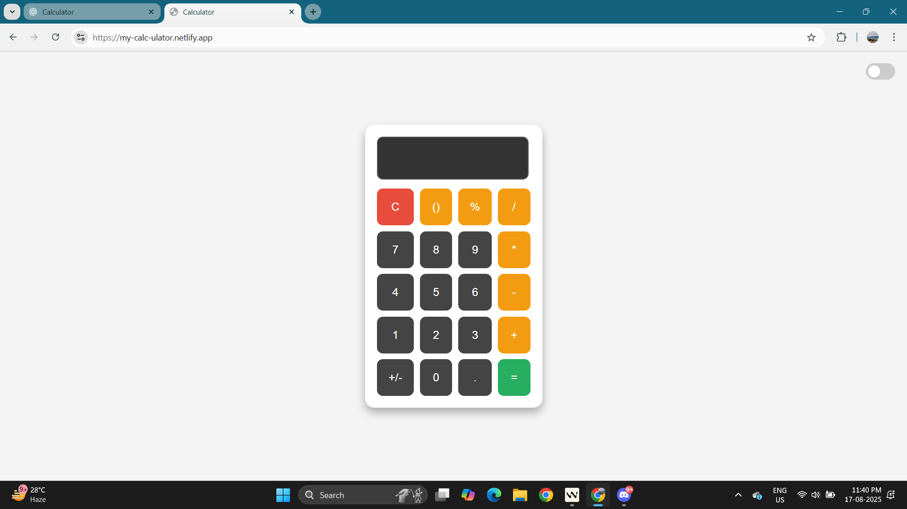
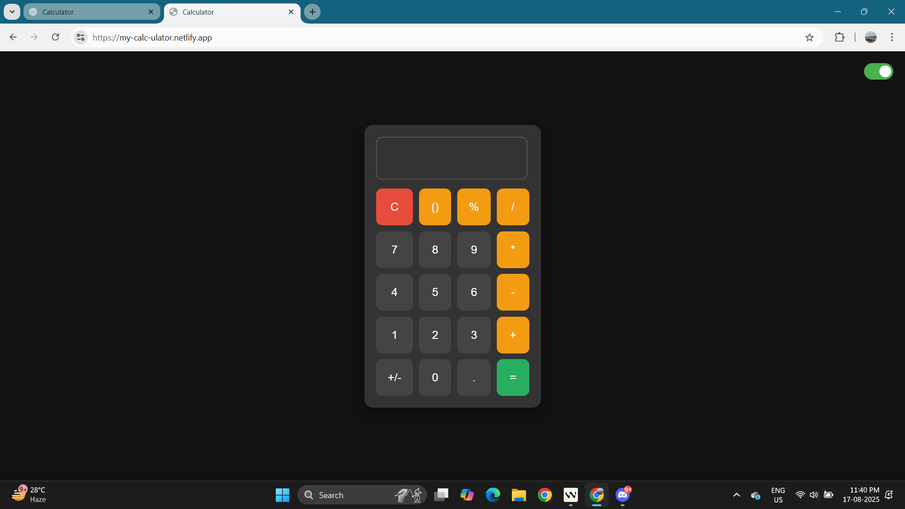

# 🔢 Calculator — Simple & Clean Web Calculator

A lightweight, responsive calculator web app built with **HTML, CSS & JavaScript**.  
Fast, mobile-friendly, and perfect as a mini-project to showcase basic frontend skills.

**Live Demo:** [Link!] (https://my-calc-ulator.netlify.app)  <!-- replace with your Netlify URL -->

---

## ✨ Features
- Basic operations: `+`, `-`, `×`, `÷`
- Clear (`C`) and delete (`←`) functions
- Keyboard support (optional)
- Mobile-responsive layout
- Clean UI ready to extend (themes, history, scientific functions)

---

## 📸 Preview
  <!-- add your screenshot at this path -->


---

## 🧰 Tech Stack
- Plain HTML5, CSS3, JavaScript (vanilla)
- Optional: CSS framework (Bootstrap / Tailwind) if added
- Hosted on **Netlify**

---

## 🚀 Run locally (two options)

### Option A — Open in browser
1. Clone the repo:
```
git clone https://github.com/Yaswanth876/calculator.git
cd calculator
```
2. Open index.html in your browser.

### Option B — Local static server (recommended)
# using Python 3
```
python -m http.server 8000
```
Then open http://localhost:8000


If the project uses a bundler (npm), then:
```
npm install
npm run build
```
serve the `dist/` or `build/` folder locally (e.g. npx serve build)
---

### ☁️ Deploying to Netlify
- Quick (Drag & Drop)
- Build the project (if required) or use the index.html root.
- Go to Netlify → Sites → "New site from drag & drop".
- Drop the produced folder (build/, dist/, or project root for static sites).

From GitHub (recommended)
- Connect your GitHub account in Netlify and choose this repository.

Set the Build command:
- If static (no build): leave blank.
- If using npm: npm run build

Set the Publish directory:
- Static site: / or public/
- Bundler: build/ or dist/ (depends on your setup)
- Deploy — Netlify will auto-build and publish.
- Replace the Live Demo URL at the top of this README with the provided Netlify URL.

---

### 🛠️ Improvements & Ideas

- Add keyboard input & accessibility features (ARIA)
- History of calculations + localStorage
- Dark mode toggle
- Add tests (Jest / Playwright) and GitHub Actions to auto-deploy
- Convert into a React app for component-based structure

---

### 🤝 Contributing

PRs welcome — please include a short description and screenshots for UI changes.

---

### 📄 License

This project is available under the MIT License.

---

### 👨‍💻 Author

**Yaswanth V**
- B.E. CSE (AI & ML)
- [GitHub](https://github.com/Yaswanth876)
- [LinkedIn](www.linkedin.com/in/yaswanthv876)
- Email: vsyaswanth008@gmail.com
